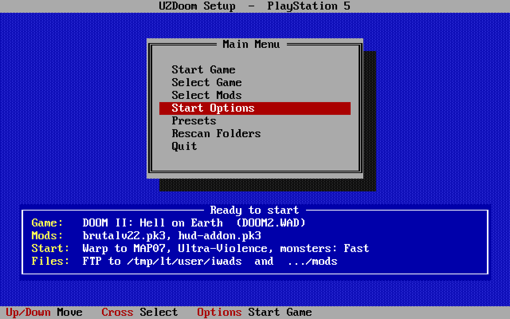
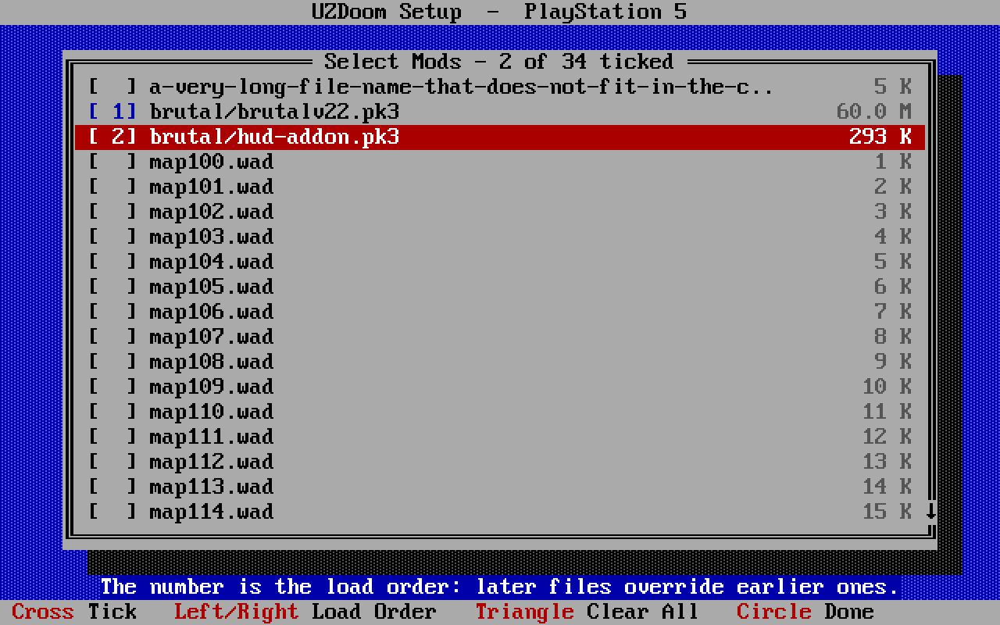

# UZDoom for PlayStation 5 (unofficial)

An unofficial port of [UZDoom](https://github.com/UZDoom/UZDoom) to the
PlayStation 5 as a homebrew title. It renders with UZDoom's Vulkan renderer on
RADV (Mesa's Vulkan driver, built for the console with
[PS5_VulkanTemplate](https://github.com/mihawk-99/PS5_VulkanTemplate)), and
starts in a DOS-style launcher where the game, the mods and the start options
are chosen with the pad.



**Not made, endorsed or supported by the UZDoom team, id Software, Sony
Interactive Entertainment or Anthropic.** Please do not report problems with
this port to the UZDoom developers.

## What you need

- A PlayStation 5 that can run homebrew. This repository contains nothing that
  makes a console able to; that is up to you, and it may void the console's
  warranty or breach the platform's terms of service.
- Your own game files (`DOOM.WAD`, `DOOM2.WAD`, ... or
  [Freedoom](https://freedoom.github.io/)). **No game data is included, and
  none will be provided or linked to.**

## Installing

1. Build the title folder (below), or take it from a release.
2. Copy the folder `PPSA99666` to `/data/homebrew/` on the console.
3. Copy game files to `/data/uzdoom/iwads/` and mods (`.pk3`, `.wad`) to
   `/data/uzdoom/mods/`, by FTP. The launcher shows the exact folder it reads.
4. Start "UZDoom" from the home screen.

## Controls

Launcher: D-pad or left stick to move, Cross to choose, Circle to go back,
L1/R1 to page, Options to start the game.

In the game the pad uses UZDoom's standard gamepad bindings, which can be
changed under Options. There is no keyboard support yet.



## Limits

Single player only for now. Quitting the game closes the title. The script JIT
is off. The full list is in [ps5/README.md](ps5/README.md).

## Building

On a Linux PC; see [ps5/README.md](ps5/README.md) for the toolkit layout and
the packages needed.

```bash
ps5/tools/build.sh                           # the title folder, dist/PPSA99666/
ps5/tools/package-source.sh dist/PPSA99666   # for a release: adds _source/
```

## Licence

GPL-3.0-or-later, as UZDoom is ([LICENSE](LICENSE)). A built title folder
carries the licence of every part in `licenses/` and the complete matching
source in `_source/`; if you pass a build on, pass those on with it.

This repository is UZDoom with the port's changes on top (branch history is
kept). Everything outside `ps5/`, `src/common/platform/posix/ps5/` and the
small patches listed in [ps5/README.md](ps5/README.md) is the UZDoom team's
work.

## AI disclosure

The PS5-specific work here - the platform layer, the launcher, the build and
packaging scripts, the patches and the documentation - was written by Claude,
an AI model made by Anthropic, under the direction of the port's maintainer,
who ran and tested the builds on a console. AI-written code can contain
mistakes that testing has not found; the port has been played on one console
and has not been audited. There is no warranty.

## Credits

- The [UZDoom](https://github.com/UZDoom/UZDoom) team, and ZDoom and GZDoom
  before it.
- mihawk-99 for [PS5_VulkanTemplate](https://github.com/mihawk-99/PS5_VulkanTemplate),
  PS5_Vulkan and the RADV port; the PS5 payload SDK authors.
- Mesa (RADV), OpenAL Soft, FluidSynth, libsndfile, mpg123, Xiph.Org's codecs.
- S. Christian Collins for the GeneralUser GS SoundFont.

"PlayStation" and "PS5" are trademarks of Sony Interactive Entertainment Inc.
DOOM is a trademark of id Software LLC.

---

*What follows is UZDoom's own README, unchanged.*

<div align="center">

[  ][repo]

</div>

## Welcome to UZDoom!

[![Continuous Integration][badge_git]][status_git]
[![Engine Translation status][badge_trans]][status_trans]
[![Game Translation status][badge_trans_games]][status_trans_games]

**UZDoom** is a modern, feature-rich source port for the classic game **DOOM**.

A continuation of [ZDoom][zdoom] and [GZDoom][gzdoom], UZDoom enhances the original DOOM engine, providing advanced features like:

* High-Resolution Graphics
* Dynamic lighting
* 3D Floors
* Extensive Modding Support
* Support for modern OpenGL and Vulkan renderers

UZDoom is **free and open-source software**, built and maintained by a dedicated community of developers and enthusiasts.

## 🙏 Acknowledgments

UZDoom would not be possible without the foundational work of many people. We extend our immense gratitude to:

* **id Software** for creating the original DOOM and releasing its source code.
* **Marisa Heit** for her foundational work on ZDoom, and **Christoph Oelckers** for his work on GZDoom.
* The countless modders, mappers, and artists in the DOOM community who continue to create amazing content.
* All the contributors who have submitted code, reported bugs, and helped improve the project over the years.

The **UZDoom Icon** was designed by **Carlos "Cardboard Marty" Sanchez**, copyrighted to the UZDoom Team, and licensed under **Creative Commons BY-SA 4.0**.

See the [CONTRIBUTORS](CONTRIBUTORS) file for a full list of code contributors.

## 📄 Legal

UZDoom is licensed under the **GNU General Public License (GPL) version 3 or any later version (GPLv3+)**.

This program is distributed in the hope that it will be useful, but **WITHOUT ANY WARRANTY**. See the GNU General Public License for more details.

You can view the full license text here: <https://www.gnu.org/licenses/>

**Copyrights:**
* Copyright 1993-1996 id Software
* Copyright 1999-2016 Marisa Heit
* Copyright 2002-2016 Christoph Oelckers
* Copyright 2017-2025 GZDoom Maintainers and Contributors
* Copyright 2025-2026 UZDoom Maintainers and Contributors

## 🌐 Resources

* [Home Page][home]
* [Wiki][wiki]
* [Discord Server][community]
* [Forum][forum]
* [Engine Translation][status_trans]
* [Game Translation][status_trans_games]

### 🛠️ Building UZDoom

To build UZDoom from source, please see UZDoom's GitHub [wiki][gh_wiki] for a full list of dependencies and detailed instructions. Build For [Linux][gh_linux] / [Windows][gh_windows] / [MacOS][gh_apple]

<div align="center">

[  ][repo]

[][status_trans]
[][status_trans_games]

</div>

[gzdoom]: https://github.com/ZDoom/gzdoom/
[zdoom]: https://github.com/rheit/zdoom/

[repo]: https://github.com/UZDoom/UZDoom/
[home]: https://zdoom.org/
[wiki]: https://zdoom.org/wiki/
[forum]: https://forum.zdoom.org/
[community]: https://dsc.gg/zdoom

[gh_wiki]: https://github.com/UZDoom/UZDoom/wiki/
[gh_linux]: https://github.com/UZDoom/UZDoom/wiki/Compilation#linux
[gh_windows]: https://github.com/UZDoom/UZDoom/wiki/Compilation#windows
[gh_apple]: https://github.com/UZDoom/UZDoom/wiki/Compilation#macos

[status_git]: https://github.com/UZDoom/UZDoom/actions/workflows/continuous_integration.yml
[badge_git]: https://github.com/UZDoom/UZDoom/actions/workflows/continuous_integration.yml/badge.svg

[badge_trans]: https://hosted.weblate.org/widget/uzdoom/svg-badge.svg
[status_trans]: https://hosted.weblate.org/engage/uzdoom/

[badge_trans_games]: https://hosted.weblate.org/widget/doom-engine-games/svg-badge.svg
[status_trans_games]: https://hosted.weblate.org/engage/doom-engine-games/
